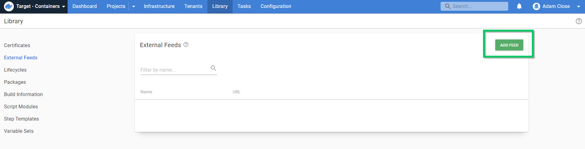
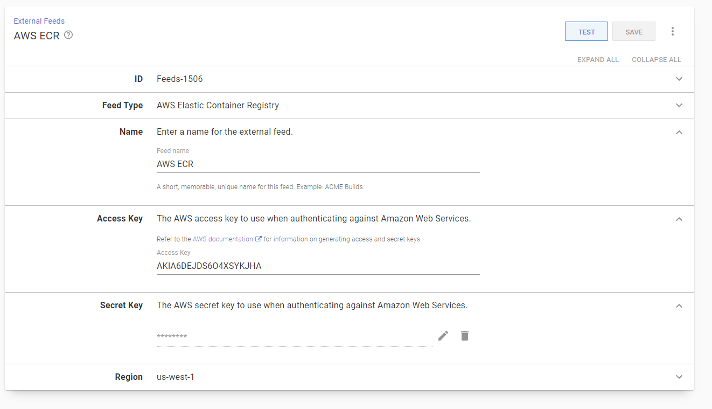

In this part of the guide we will create an external feed to our [AWS ECR](https://aws.amazon.com/ecr/).

To create a new Octopus Feed, go to ( {{Library, External Feeds}} ) and click **ADD FEED**.

Change the feed type to `AWS Elastic Container Registry` and fill in the of the paramaters.

You will need to provide the credentials configured above, as well as the region at which the registry was created. In AWS you are able to maintain separate repositories in each region.

<a class="btn btn-secondary" href="/docs/deployments/ecs/guides">Previous</a>&nbsp;&nbsp;&nbsp;&nbsp;&nbsp;<a class="btn btn-success" href="/docs/deployments/ecs/guides/creating-a-new-project">Next</a>