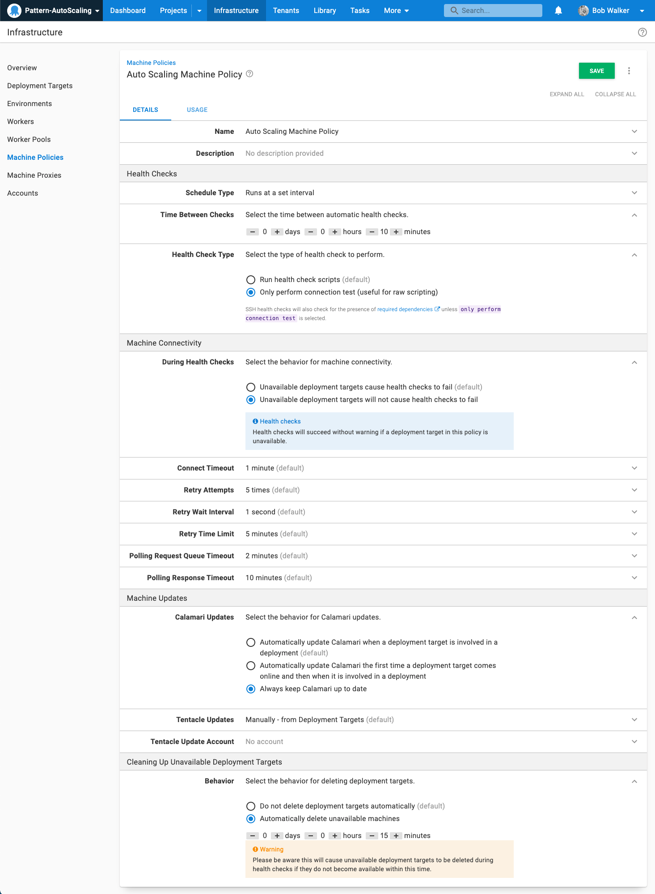
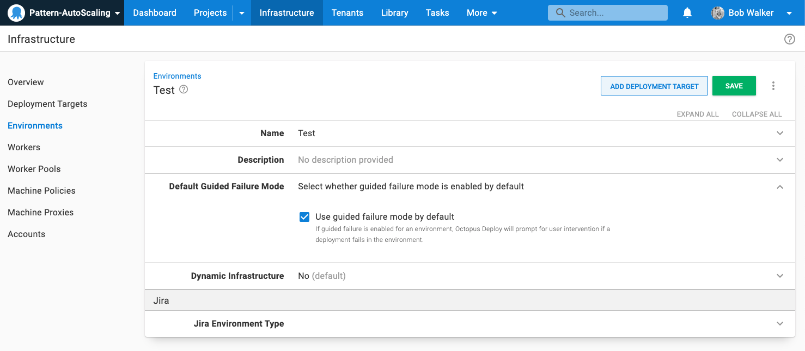
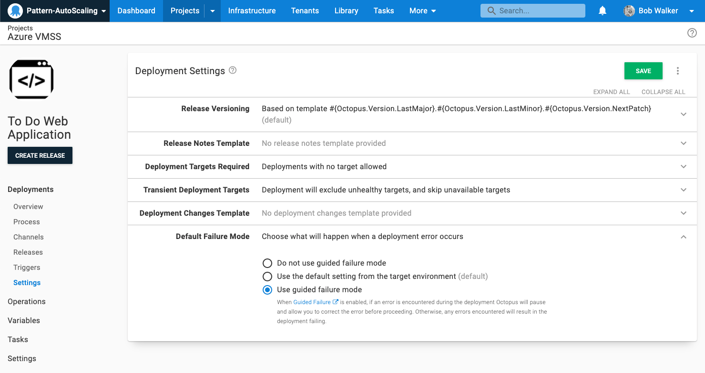

[Azure Virtual Machine Scale Sets](https://azure.microsoft.com/en-us/services/virtual-machine-scale-sets/) (VMSS) are an auto-scaling technology you can use with Octopus Deploy.  Unlike technologies such as [Azure Web Apps](https://azure.microsoft.com/en-us/services/app-service/web/) or [Azure Kubernetes Service](https://azure.microsoft.com/en-us/services/kubernetes-service/#overview), each instance in a VMSS has to be registered with Octopus Deploy.  This guide will walk you through how to use VMSS with Octopus Deploy, some common pitfalls, as well as a new [Check VMSS Provsion Status step template](https://library.octopus.com/step-templates/e04c5cd8-0982-44b8-9cae-0a4b43676adc/actiontemplate-check-vmss-provision-status) in the library to make it easier to manage scale out and scale in events.

# Terminology

As you read this guide you will encounter the following terminology you should familiarize yourself with.

- **Scale Out**: When a Virtual Machine Scale Set adds Virtual Machines.  This can be triggered via a defined rule or manually.
- **Scale In**: When a Virtual Machine Scale Set removes Virtual Machines.  This can be triggered via a defined rule or manually.
- **Overprovisioning**: When the Virtual Machine Scale set creates more Virtual Machines than asked for.  This is done to improve the speed and success rate when scaling out.  Overprovisioning is enabled by default.

# Prep Work

If you plan on using Octopus Deploy with Virtual Machine Scale Sets, there is some prep-work in Octopus Deploy.

## Custom Machine Policy

Create a custom machine policy to be used for deployment targets in Virtual Machine Scale Sets.  Change the following settings from the default machine policy:

- Interval: 10 minutes
- During Health Checks: Unavailable deployment targets will not cause health checks to fail
- Calamari Updates: Always keep Calamari up to date
- Clean Up Unavailable Deployment Targets: Automatically delete unavailable machines after 15 minutes

These settings make it easier for Octopus Deploy to handle VMSS scale out and scale in events.  The interval and handling of unavailable deployment targets will allow Octopus Deploy to clean up machines that have been removed due to a scale in event.  In a nutshell, if a machine is removed and Octopus can't find it, it will be removed after 20 minutes.

When new machines are added a health check automatically kicks off.  That health check will verify the machine can be connected to and the state of the tentacle.  Setting Calamari to always be kept up to date means Calamari will be installed during that initial health check, which makes getting the new machine up and running faster.

## Project Settings

Any project that will deploy to virtual machines in a Virtual Machine Scale Set should be configured to:

- Deployment Targets Required: Allow deployments to be created when there are no deployment targets
- Unavailable Deployment Targets: Skip and Continue (specify a role)
- Unhealthy Deployment Targets: Exclude (in the event the machine policy hasn't removed the server yet)

A deployment will fail when a deployment target is removed while running a step on it.  The recommendation is to configure [guided failure mode](docs/releases/guided-failures.md).  Any errors will pause the deployment and ask for user intervention.

Guided failure mode can be configured at the environment level.

Or, at the project level.

# Scaling Out

Our recommendation is to use [deployment target triggers](/docs/projects/project-triggers/deployment-target-triggers.md).  They will fire anytime a new deployment target is found.  In our testing, we have found it is normal to see a trigger do a deployment back to back.  

- The number of instances in a VMSS is increased from 1 to 10.
- Octopus Deploy sees 4 of the 9 new VMs have come online and trigger a deployment.
- After that deployment is finished, Octopus Deploy will see the remaining 5 VMs and trigger a new deployment.

If your deployments are quick (less than five minutes), that behavior might not be much of a concern.  However, some of our customers' deployment will also ensure all the necessary software (IIS, Java, .NET, NGINX, etc.) is installed and configured properly.  That above behavior can mean a scale out event that would take 10-30 minutes to finish will take 20-60 minutes.  

This guide is designed to address that issue by using the new [Check VMSS Provsion Status step template](https://library.octopus.com/step-templates/e04c5cd8-0982-44b8-9cae-0a4b43676adc/actiontemplate-check-vmss-provision-status).

- When a scale out event occurs, Octopus Deploy will wait until all machines are provisioned then do the deployment.  In most cases Virtual Machines finish provisioning within 60-90 seconds of each other.
- The deployment will only include new Deployment Targets.  Any pre-existing Deployment Targets will be left alone.
- Virtual Machine Scale Sets support [overprovisioning](https://docs.microsoft.com/en-us/azure/virtual-machine-scale-sets/virtual-machine-scale-sets-design-overview#overprovisioning).  Any overprovisioned and removed machines should be removed and NOT be deployed to.

## Separate Project for VMSS Interaction

Due to the scattershot nature of how VMs are provisioned, we have found configuring a separate project for managing VMSS and Octopus Deploy interaction offers the best chance of success.  The separate project used to manage VMSS and Octopus interaction will have a lot of responsibility.  It will handle:

- **Deployment Target Triggers**: The project will house all the deployment target triggers.
- **Wait until all VMs are provisioned**: The new [Check VMSS Provsion Status step template](https://library.octopus.com/step-templates/e04c5cd8-0982-44b8-9cae-0a4b43676adc/actiontemplate-check-vmss-provision-status) will pause the deployment and wait until all new VMs have finished provisioning.
- **Triggering a deployment for the new deployment targets**: Once the VMSS finishes provisioning, you can use the [Deploy Child Project step template](https://library.octopus.com/step-templates/0dac2fe6-91d5-4c05-bdfb-1b97adf1e12e/actiontemplate-deploy-child-octopus-deploy-project) to redeploy the latest release for the newly added machines.
- **Handle VMSS Overprovisioning and reconciliation**: The [Check VMSS Provsion Status step template](https://library.octopus.com/step-templates/e04c5cd8-0982-44b8-9cae-0a4b43676adc/actiontemplate-check-vmss-provision-status) will automatically remove any over provisioned machines.
- **Duplicate runs caused by how VMSS provisions VMs**: The [Check VMSS Provsion Status step template](https://library.octopus.com/step-templates/e04c5cd8-0982-44b8-9cae-0a4b43676adc/actiontemplate-check-vmss-provision-status) will detect a duplicate run caused by a trigger and give you the option to cancel it or use a output variable to skip the remaining steps.

## Configuring the VMSS Orchestration Project

1. On your Octopus instance click on **{{Project, Add Project}}**.
2. Enter in a **Project Name** and click **Save**
3. From the project overview screen go to **{{Deploy, Triggers}}**.

# Design Considerations
Virtual Machine Scale Sets provide the ability to define a series of rules to determine when to scale out.  Some examples of rules include:

- Scale out to 20 machines at 6 AM
- Scale out by 3 machines if CPU usage is over 60%
- Scale out by 2 machines if Network usage goes over 100 MB/s.

If you are starting out with VMSS you can also manually scale out.  

:::hint
Start out manually scaling out and in or leverage the scheduling functionality.  Scaling out via a metric is very powerful, but it requires a lot of data points to prevent unnecessary scaling out events.
:::

Octopus Deploy, along with the new [step template](https://library.octopus.com/step-templates/e04c5cd8-0982-44b8-9cae-0a4b43676adc/actiontemplate-check-vmss-provision-status) will handle both the automatic and manual scale out events.

## Registering Tentacles from VMs in a Virtual Machine Scale Set

When a scale out event occurs, new virtual machines will be created.  A tentacle must be installed and configured in order to be able to deploy/run runbooks on VMs managed by a Virtual Machine Scale Set.  You have two options with Virtual Machine Scale Sets, a custom image or bootstrap script.  No matter which option you choose, you should become familar with how to automate tentacle installation.

- [Windows](/docs/infrastructure/deployment-targets/windows-targets/automating-tentacle-installation.md)
- [Linux](/docs/infrastructure/deployment-targets/linux/tentacle/index.md#automation-scripts)

Azure provides an extension to let you run a custom script on machine startup.  

- [Windows Custom Script Extension](https://docs.microsoft.com/en-us/azure/virtual-machines/extensions/custom-script-windows)
- [Linux Custom Script Extension](https://docs.microsoft.com/en-us/azure/virtual-machines/extensions/custom-script-linux)

Scripts should be written as idempotent, as you have will have no idea how many times a script be run by the VMSS.  For Octopus Tentacles, attempting to install the same tentacle instance multiple times will cause it to fail.  We have sample scripts you can use as a basis for your scripts.

- [Listening Tentacles](https://github.com/OctopusSamples/IaC/blob/master/bootstrap/Windows/BootstrapListeningTentacle.ps1)
- [Polling Tentacles](https://github.com/OctopusSamples/IaC/blob/master/bootstrap/Windows/BootstrapPollingTentacle.ps1)

## Use Custom Images or Provided Images

VMSS allow you to create VMs from custom images uploaded by you.  A custom image is one you build with all the required software (IIS, Java, NGINX, etc.) pre-installed.  If you are going to create a custom image our recommendation is to:

- Have the tentacle pre-installed on the custom image.
- Use the custom script extension to configure the tentacle.

Configuring the tentacle will require you to provide an Octopus URL, API Key, Thumbprint, Server Roles, Environments, and Tenants.  With this approach you can have a single custom image per operating system, rather than a custom image per application.

:::hint
Use the provided images plus the custom script extension to download, install, and configure the tentacle when starting out.  Creating a custom image puts the reponsibility on you to keep the image up to date with the latest patches and bug fixes. 
:::

## Overprovisioning

 The guide below will address reconciling this list via both deployment target triggers along with schedule triggers.

