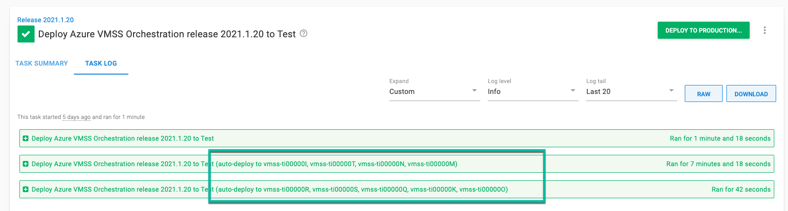

A scale out event is when virtual machines are added to an auto-scaling group.  It can be triggered automatically via a configured rule, or manually by a person.  When a scale out event occurs, the new virtual machines will need to be added to Octopus Deploy.  This guide will provide you the various options on how to do this.

# Deployment Target Triggers

Our recommendation is to use [deployment target triggers](/docs/projects/project-triggers/deployment-target-triggers.md) tied to a `Machine Created` event.  It is the easiest way to handle scale out events.  When a new virtual machine registers itself with Octopus Deploy, the trigger will fire and deploy to those newly created machines.

To configure a deployment target trigger you will want to:

1. From the project overview screen go to **{{Deployments, Triggers}}**.
2. In the top right cornger click on **{{Add Trigger, Deployment target trigger}}**.
3. Configure the following settings:
    - Name: Provide a name for the trigger.
    - Event Categories: select `Machine Created`.
    - Environments: enter the environments the VMSS exists in.
    - Target roles: select the target role of the VMs in the VMSS.
4. Click **SAVE** to save the new trigger.

# Machine Roles

Each deployment target in Octopus Deploy can have 1 or multiple [machine roles](/docs/getting-started/best-practices/environments-and-deployment-targets-and-roles.md#deployment-target-environment-and-role-relationship).  To help identify which deployment targets are in a auto scaling group, we recommend adding a role to the deployment target for each VM.  The role should only be used for Octopus Deploy / VMSS interaction.  You should have other roles for deployments.

The name of the role should be unique for the auto scaling group.  If you have multiple auto scaling groups in an environment (perhaps broken up by region), we recommend a unique tag per region.

For example, a To-Do web with a single Virtual Machine Scale Set per environment would have the roles.  The roles `azure-todo-web-server` is what the deployment process would target.  The role `vmss-scale-set-todo-web` would be used to determine how many deployment targets are in the VMSS in a specific environment.

- Test: `azure-todo-web-server` and `vmss-scale-set-todo-web`
- Production `azure-todo-web-server` and `vmss-scale-set-todo-web`

But if you have multiple VMSS in an environment, one per region then you would have the following tags.

- Test (North Central US): `azure-todo-web-server` and `vmss-scale-set-todo-web-northcentralus`
- Production (North Central US): `azure-todo-web-server` and `vmss-scale-set-todo-web-northcentralus`
- Production (North Central US): `azure-todo-web-server` and `vmss-scale-set-todo-web-southcentralus`

# Auto Scaling and Deployment Target Trigger Behavior

Deployment target triggers work great when the expected number of virtual machines added in a scale out event is less than or equal to 5.  In our testing, we found when the scale out event is greater than 5 the following will happen:

- The number of instances in a VMSS is increased from 1 to 10.
- Octopus Deploy sees 4 of the 9 new VMs have come online and trigger a deployment.
- After that deployment is finished, Octopus Deploy will see the remaining 5 VMs and trigger a new deployment.

Some of our customers' deployment will also ensure all the necessary software (IIS, Java, .NET, NGINX, etc.) is installed and configured properly.  Thie behavior can cause a scale out event to take twice as long as expected.  Two step templates have been created to address that behavior for AWS Auto Scaling Groups and Azure Virtual Machine Scale Sets.  

- [Check VMSS Provsion Status step template](https://library.octopus.com/step-templates/e04c5cd8-0982-44b8-9cae-0a4b43676adc/actiontemplate-check-vmss-provision-status)
- [Check ASG Provsion Status step template](TBD)

While they target different technologies, the basically work the same.

- When a scale out event occurs, Octopus Deploy will wait until all machines are provisioned then do the deployment.
- They will detect when a duplicate trigger run occurs and give you the option to cancel the deployment or proceed.
- They will set output variables containing the names and ids of the newly created virtual machines.
- They will reconcile the list in the auto scaling group with what is stored in Octopus Deploy.  Any Virtual Machines in Octopus Deploy not in the auto scaling group will be removed from Octopus Deploy.

# Processing Scale Out Events

There are three possible ways to process a scale out event in Octopus Deploy.  Each has its own pro and con.  We want to provide you the necessary options and you can make the determination on how to handle the scale out event.

## Option 1: Wait for deployment target triggers to fire for all new machines

With this option, there is not anything extra to configure outside of the deployment target trigger.  As new machines come online, Octopus Deploy will pick them up and deploy to them.  

- Pros: Very little to configure, except for deployment target triggers
- Cons: Scaling out takes much longer; instead of 10-30 minutes, it could take 20-60 minutes.

**Recommendation**: Use this option when scaling less than or equal to 5 VMs at a time or your deployments are so quick the above trigger behavior doesn't matter.

## Option 2: Leverage Octopus Deploy Runbooks to manually scale out

With this option you create an [Octopus Deploy Runbook](/docs/runbooks/index.md) to manually scale out.  The runbook will invoke the cloud providers CLI or API to set the number of virtual machines.  This is not used in conjunction with triggers, this is an alternative to triggers.

- Pros: 
    - Don't have to worry about unpredictiable trigger behavior.  
    - One tool controls the entire lifecycle of the scale out event.
    - Self Service, anyone with permissions to the runbook can scale out, but you don't have to grant access to your cloud provider. 
- Cons:
    - Limited to schedule scale events only.  No auto-scaling rules based on CPU/Network/Memory metrics can be configured via Octopus Deploy.
    - While it is possible to have rules configured, you'd have two places managing the number of virtual machines.

**Recommendation**: Use this when you want to enable development teams to scale out their infrastructure, but not give them full access to your cloud provider.

[Guide](TBD)

## Option 3: Leverage Deployment Targets and new step templates

Using the new step templates you can create a process that will leverage deployment target triggers, but it will also wait until the VMSS is finished being configured.

- Pros:
    - Uses deployment target triggers, allowing you to have both manual and automatic scale out events.
    - Waits for the scale out event to finish, bypassing the worry of taking twice as long.
    - Can isolate down the auto scaling interaction to a separate project OR incorporate into your existing projects (see guides below).
- Cons:
    - The step template is not perfect, you need to account for a "duplicate run."
    - Much more to configure.
    - Uses more advanced features such as variable run conditions.

**Recommendation**: Use this option when scaling an auto scaling group by more than 5 virtual machines AND you need to wait for all of them to finish provisioning before moving on.

- [GUIDE for Single Process](TBD)
- [GUIDE for Orchestration Process](TBD)

