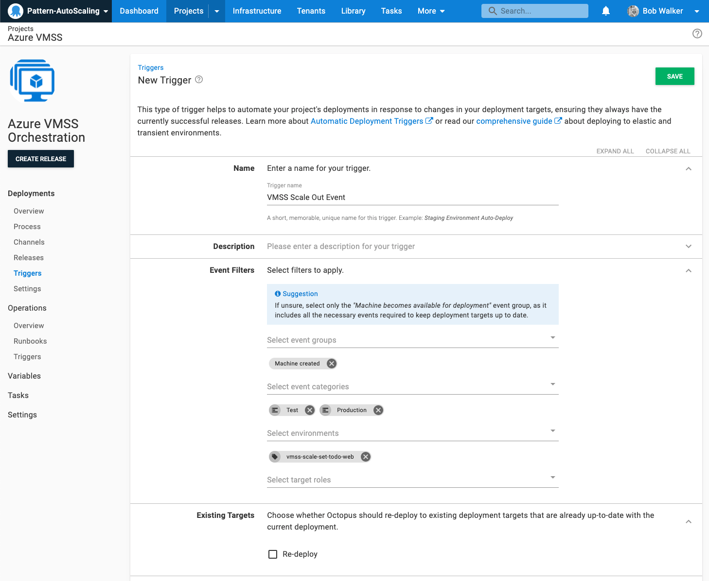
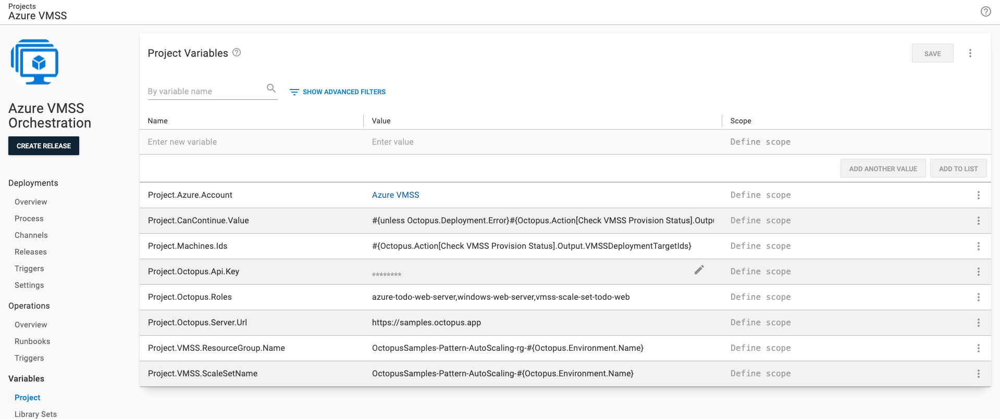
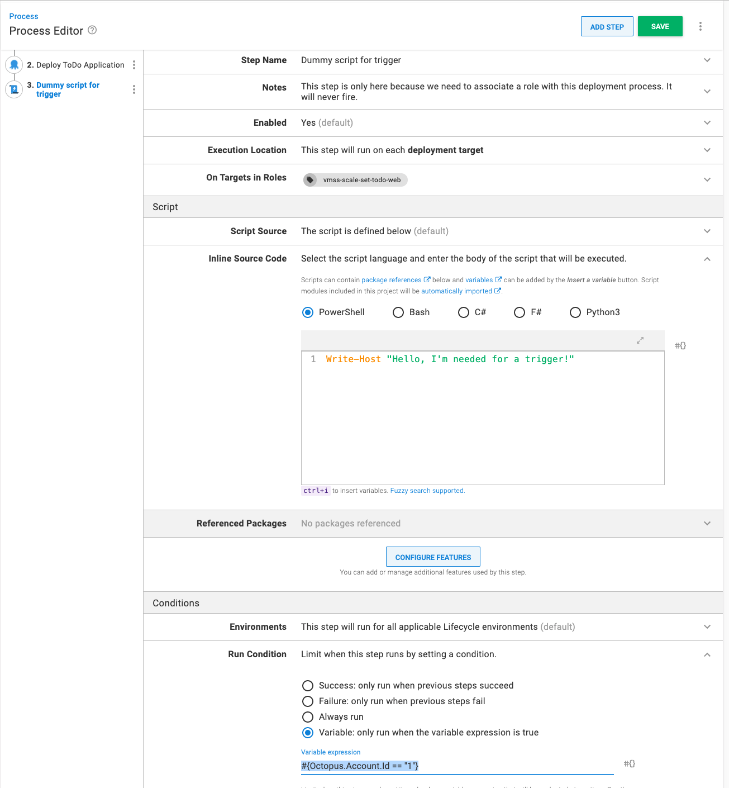

This guide will use the [Check VMSS Provsion Status step template](https://library.octopus.com/step-templates/e04c5cd8-0982-44b8-9cae-0a4b43676adc/actiontemplate-check-vmss-provision-status) in a separate orchestration project.  Once the VMSS finishes scaling out the step template will reconcile the list and then you can use the [Deploy Child Octopus Deploy Project step template](https://library.octopus.com/step-templates/0dac2fe6-91d5-4c05-bdfb-1b97adf1e12e/actiontemplate-deploy-child-octopus-deploy-project) to trigger a deployment.    

:::hint
A separate orchestration project is useful when you don't want to modify any existing deployments OR when the virtual machines host multiple applications and you want to control the sequence of deployments.  
:::

### Configuring the VMSS Orchestration Project

You will want to ensure your orchestration project can handle scale out and scale in events.

1. On your Octopus instance click on **{{Project, Add Project}}**.
2. Enter in a **Project Name** and click **Save**
3. From the project overview screen go to **{{Deployments, Settings}}**.
4. Configure the following settings:
    - Deployment Targets Required: Change to `Allow deployments to be created when there are no deployment targets`.
    - Transient Deployment Targets - Unavailable Deployment Targets: Change to `Skip and Continue`.  Add the role assigned to VMs in the virtual machine scale set.
    - Transient Deployment Targets - Unhealthy Deployment Targets: Change to `Exclude`.
5. Click **SAVE** to save the changes.

These settings will enable you to create a release the deployment target triggers to use to on a scale out event.

Next, configure deployment target triggers to trigger a deployment anytime a new deployment target is found.  

1. From the project overview screen go to **{{Deployments, Triggers}}**.
2. In the top right cornger click on **{{Add Trigger, Deployment target trigger}}**.
3. Configure the following settings:
    - Name: Provide a name for the trigger.
    - Event Categories: select `Machine Created`.
    - Environments: enter the environments the VMSS exists in.
    - Target roles: select the target role of the VMs in the VMSS.
4. Click **SAVE** to save the new trigger.

### Configure Variables

The [Check VMSS Provsion Status step template](https://library.octopus.com/step-templates/e04c5cd8-0982-44b8-9cae-0a4b43676adc/actiontemplate-check-vmss-provision-status) has some parameters without defaults.  It will also set a couple of output variables.

- Project.Azure.Account: Variable for the Azure Account used to invoke the Azure PowerShell commands
- Project.CanContinue.Value: `#{unless Octopus.Deployment.Error}#{Octopus.Action[Check VMSS Provision Status].Output.VMSSHasServersToDeployTo}#{/unless}` (The output variable indicating there are new deployment targets to deploy to)
- Project.Machine.Ids: `#{Octopus.Action[Check VMSS Provision Status].Output.VMSSDeploymentTargetIds}` (The output variable containing all the deployment targets to deploy to)
- Project.Octopus.Api.Key: API Key of a service account that has Environment Manager, Project Viewer, and Deployment Creator roles assigned to it.
- Project.Octopus.Roles: The list of roles, for example `azure-todo-web-server,windows-web-server,vmss-scale-set-todo-web` that uniquely identifies a set of deployment targets in Octopus assigned to the VMSS (the more roles the lower the chance of a false positive).
- Project.Octopus.Server.Url: `#{Server.Base.Uri}`
- Project.VMSS.ResourceGroup.Name: The name of the resource group the VMSS is assigned to.
- Project.VMSS.ScaleSetName: The name of the Virtual Machine Scale Set.

### Configure Deployment Process

This is an example deployment process representing an MVP for a VMSS Orchestration project.  It does not include any sort of approvals or notifications.  

The deployment process is:
1. Check VMSS Provision Status
2. Deploy Child Project
3. Dummy Script for trigger

The first step will use the [Check VMSS Provsion Status step template](https://library.octopus.com/step-templates/e04c5cd8-0982-44b8-9cae-0a4b43676adc/actiontemplate-check-vmss-provision-status).  Provide values for the following parameters (leave all the others as is):

- VMSS Name: `#{Project.VMSS.ScaleSetName}`
- VMSS Resource Group Name: `#{Project.VMSS.ResourceGroup.Name}`
- Azure Account: Project.Azure.Account
- Deployment Target Roles: `#{Project.Octopus.Roles}`
- Octopus Url: `#{Project.Octopus.Server.Url}`
- Octopus API Key: `#{Project.Octopus.Api.Key}`

The second step will use the [Deploy Child Octopus Deploy Project step template](https://library.octopus.com/step-templates/0dac2fe6-91d5-4c05-bdfb-1b97adf1e12e/actiontemplate-deploy-child-octopus-deploy-project).  Provide values for the following parameters (leave all the others as is):

- Octopus Base Url: `#{Project.Octopus.Server.Url}`
- Octopus API Key: `#{Project.Octopus.Api.Key}` 
- Child Project Name: The name of the project you wish to deploy
- Deployment Mode: Redeploy
- Specific Deployment Target: `#{Project.Machines.Ids}`

The final step is only there so the deployment target trigger picks up the new virtual machines added to the VMSS.

- Execution Location: deployment target
- On Targets in Roles: The roles assigned to VMs specific to the VMSS
- Inline Source Code: `Write-Host "Hello World"`
- Run Condition: Variable set to `#{Octopus.Account.Id == "1"}` (this step will never run, we only need it to glue the trigger to the VMSS)

### Create Release

That should be it.  Create a new release and deploy it to your first environment you want to monitor.  The deployment target trigger should pick up and new VMs added and will run this process.   