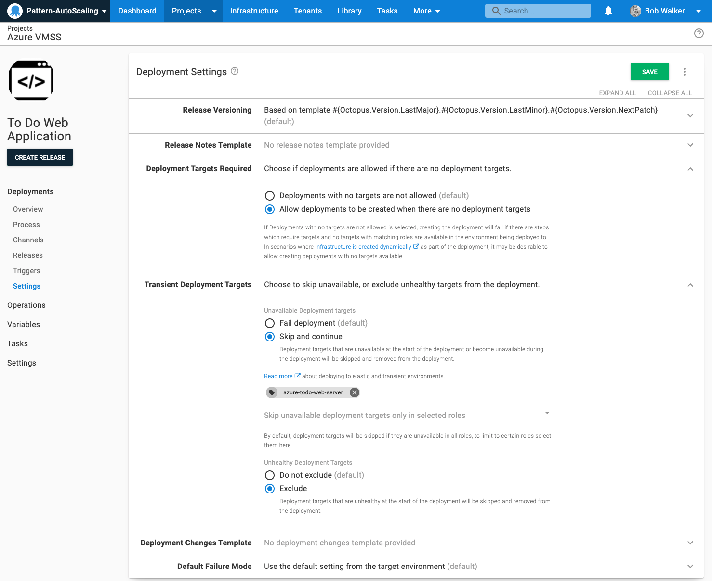

There is some prep work to do prior to configuring triggers and setting up targets.

# Custom Machine Policy

Creating a custom machine can make it easier to handle scale out events. 

1. Create a new machine policy to be used only for auto-scaling deployment targets.
2. Change the following settings from the default machine policy:
    - Interval: 10 minutes
    - During Health Checks: Unavailable deployment targets will not cause health checks to fail
    - Calamari Updates: Always keep Calamari up to date

When new machines are added a health check automatically kicks off.  That health check will verify the machine is running and Octopus can connect to it.  Setting Calamari to always be kept up to date means Calamari will be installed during that initial health check, which makes getting the new machine up and running faster.

# Project Settings

Any project that will deploy to auto-scaling virtual machines should have the deployment settings updated to:

- Deployment Targets Required: Allow deployments to be created when there are no deployment targets
- Unavailable Deployment Targets: Skip and Continue (specify a role)
- Unhealthy Deployment Targets: Exclude

Some auto-scaling technologies allow you to set the number of virtual machines to zero.  But you'll still need to deploy.  That is why the deployment targets required is set to allow deployments when there are no deployment targets.

The settings around unavailable and unhealthy deployment targets are there to handle when a scale-in event occurs.  If Octopus thinks a virtual machine still exists, but it has been deleted in the auto-scaling group, then you'll need to be able to skip them. 

# Machine Roles

Each deployment target in Octopus Deploy can have 1 or multiple [machine roles](/docs/getting-started/best-practices/environments-and-deployment-targets-and-roles.md#deployment-target-environment-and-role-relationship).  To help identify which deployment targets are in a auto scaling group, we recommend adding a role to the deployment target for each VM.  The role should only be used for Octopus Deploy / VMSS interaction.  You should have other roles for deployments.

The name of the role should be unique for the auto scaling group.  If you have multiple auto scaling groups in an environment (perhaps broken up by region), we recommend a unique tag per region.

For example, a To-Do web with a single Virtual Machine Scale Set per environment would have the roles.  The roles `azure-todo-web-server` is what the deployment process would target.  The role `vmss-scale-set-todo-web` would be used to determine how many deployment targets are in the VMSS in a specific environment.

- Test: `azure-todo-web-server` and `vmss-scale-set-todo-web`
- Production `azure-todo-web-server` and `vmss-scale-set-todo-web`

But if you have multiple VMSS in an environment, one per region then you would have the following tags.

- Test (North Central US): `azure-todo-web-server` and `vmss-scale-set-todo-web-northcentralus`
- Production (North Central US): `azure-todo-web-server` and `vmss-scale-set-todo-web-northcentralus`
- Production (North Central US): `azure-todo-web-server` and `vmss-scale-set-todo-web-southcentralus`