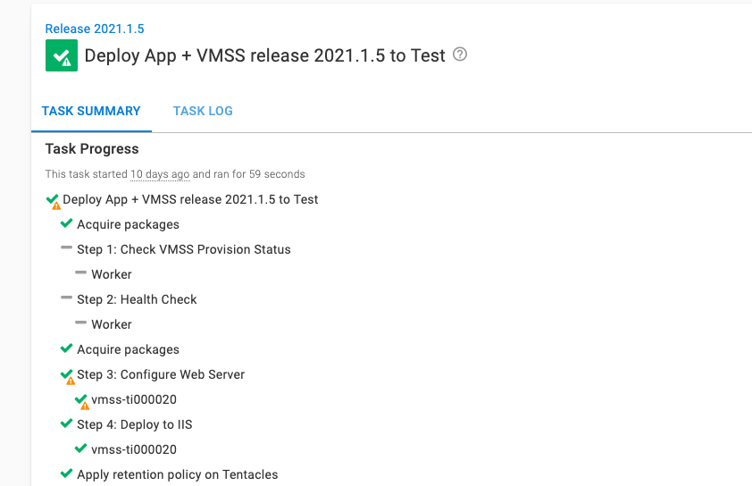
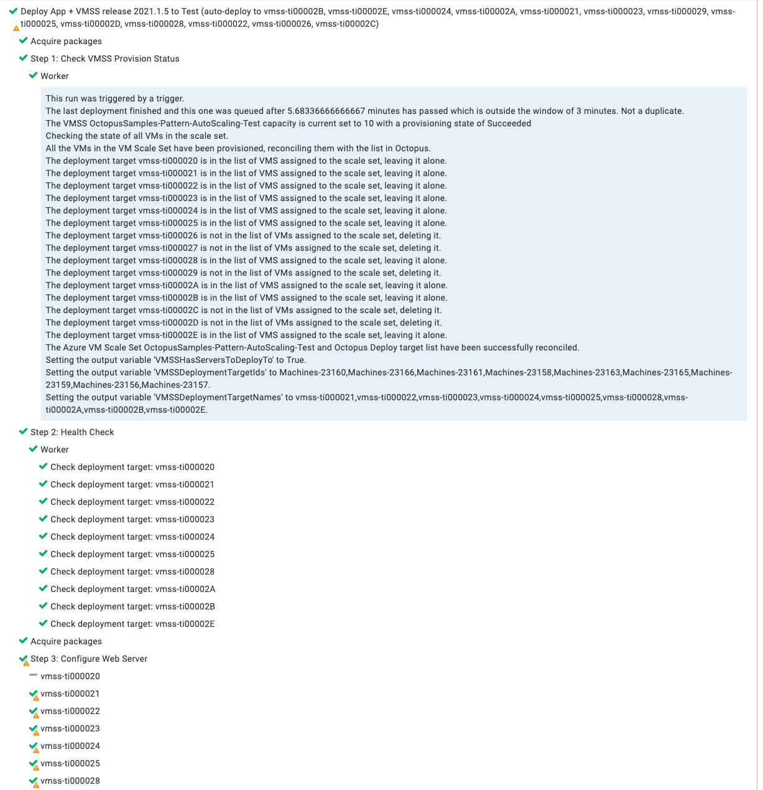

This guide will walk you through project configuration as well as adding the [Check VMSS Provsion Status step template](https://library.octopus.com/step-templates/e04c5cd8-0982-44b8-9cae-0a4b43676adc/actiontemplate-check-vmss-provision-status-(deployment-targets)) and the [health check](/docs/projects/built-in-step-templates/health-check.md) steps into your existing projects to handle scale out events.  

:::warning
This option requires a variable filter added in **Octopus Deploy 2021.2.**
:::

:::hint
Adding steps to an existing project works best when the deployment process deploys all the applications hosted in the virtual machine.  If you have multiple applications deployed by multiple projects, consider using a [an orchestration project](/docs/deployments/patterns/auto-scaling-deployment-targets/scale-out/scale-out-orchestration-project.md).
:::

# Configuring the Orchestration Project

There is some prep work to do before adding the two steps to your deployment process.

1. Configure Project settings
2. Create a Trigger
3. Configure Variables

## Project Settings

You will want to ensure your orchestration project can handle scale out events.

1. On your Octopus instance click on **{{Project, Add Project}}**.
2. Enter in a **Project Name** and click **Save**
3. From the project overview screen go to **{{Deployments, Settings}}**.
4. Configure the following settings:
    - Deployment Targets Required: Change to `Allow deployments to be created when there are no deployment targets`.
    - Transient Deployment Targets - Unavailable Deployment Targets: Change to `Skip and Continue`.  Add the role assigned to VMs in the auto scaling group.
    - Transient Deployment Targets - Unhealthy Deployment Targets: Change to `Exclude`.
5. Click **SAVE** to save the changes.


These settings will enable you to create a release the deployment target triggers to use to on a scale out event.

## Create a Trigger

Next, configure a deployment target trigger to re-run a deployment anytime a new virtual machine registers with Octopsu Deploy.  

1. From the project overview screen go to **{{Deployments, Triggers}}**.
2. In the top right cornger click on **{{Add Trigger, Deployment target trigger}}**.
3. Configure the following settings:
    - Name: Provide a name for the trigger.
    - Event Categories: select `Machine Created`.
    - Environments: enter the environments the auto scaling group exists in.
    - Target roles: select the target role of the VMs in the auto scaling group.
4. Click **SAVE** to save the new trigger.


## Configure Variables

The new step templates, such as [Check VMSS Provsion Status step template](https://library.octopus.com/step-templates/e04c5cd8-0982-44b8-9cae-0a4b43676adc/actiontemplate-check-vmss-provision-status-(deployment-targets)) has some parameters without defaults.  It will also set a couple of output variables.

- Project.Azure.Account: Variable for the Azure Account used to invoke the Azure PowerShell commands
- Project.CanContinue.Value: `#{unless Octopus.Deployment.Error}#{Octopus.Action[Check VMSS Provision Status].Output.VMSSHasServersToDeployTo}#{/unless}` (The output variable indicating there are new deployment targets to deploy to)
- Project.Machine.Ids: `#{Octopus.Action[Check VMSS Provision Status].Output.VMSSDeploymentTargetIds}` (The output variable containing all the deployment targets to deploy to)
- Project.Octopus.Api.Key: API Key of a service account that has Environment Manager, Project Viewer, and Deployment Creator roles assigned to it.
- Project.Octopus.Roles: The list of roles, for example `azure-todo-web-server,windows-web-server,vmss-scale-set-todo-web` that uniquely identifies a set of deployment targets in Octopus assigned to the VMSS (the more roles the lower the chance of a false positive).
- Project.Octopus.Server.Url: `#{Server.Base.Uri}`
- Project.VMSS.ResourceGroup.Name: The name of the resource group the VMSS is assigned to.
- Project.VMSS.ScaleSetName: The name of the Virtual Machine Scale Set.


# Add Steps To Your Deployment Process

You will need to add two steps to your deployment process.  The first step will be one of the new step templates, for example [Check VMSS Provsion Status step template](https://library.octopus.com/step-templates/e04c5cd8-0982-44b8-9cae-0a4b43676adc/actiontemplate-check-vmss-provision-status-(deployment-targets)).  The second step will be the [Health Check Step](https://octopus.com/docs/projects/built-in-step-templates/health-check).

You will also need to modify a few steps to use a [variable run condition](/docs/projects/steps/conditions.md#variable-expressions).

## Add Check Provision Status Step Template
First, add the one the new check provision status step templates to the start of your deployment process.  In this example, add the step [Check VMSS Provsion Status step template](https://library.octopus.com/step-templates/e04c5cd8-0982-44b8-9cae-0a4b43676adc/actiontemplate-check-vmss-provision-status-(deployment-targets)).  Provide values for the following parameters (leave all the others as is):

- VMSS Name: `#{Project.VMSS.ScaleSetName}`
- VMSS Resource Group Name: `#{Project.VMSS.ResourceGroup.Name}`
- Azure Account: Project.Azure.Account
- Deployment Target Roles: `#{Project.Octopus.Roles}`
- Octopus Url: `#{Project.Octopus.Server.Url}`
- Octopus API Key: `#{Project.Octopus.Api.Key}`
- Exclude Pre-Existing Servers from Output: Yes

Set the run condition for this step to be: `#{unless Octopus.Deployment.Error}#{if Octopus.Deployment.Trigger.Name}True#{/if}#{/unless}`.  That run condition will cause the step to only run when a deployment target trigger causes a deployment.

## Add Health Check Step
Next, add the [Health Check Step](/docs/projects/built-in-step-templates/health-check.md) to the deployment process.  It should come after the check provision status step template.  Set the following values:

- On Targets in Roles: Use the same role as your project is currently deploying to.
- Health Check Type: Perform a connection-only test
- Health check Errors: Skip deployment targets that are unavailable
- New Deployment Targets: Include new deployment targets in the deployment

Set the run condition to also be `#{unless Octopus.Deployment.Error}#{if Octopus.Deployment.Trigger.Name}True#{/if}#{/unless}`.  

## Update existing deployment steps
For any remaining deployment steps, change the run condition to be (split into multiple lines for easy readability).

**Please Note**: The name of the check provision status step might be different than this example.

```
#{unless Octopus.Deployment.Error}
	#{if Octopus.Deployment.Trigger.Name}
    	#{Project.Machines.IdList | Contains #{Octopus.Action[Check VMSS Provision Status].Output.VMSSDeploymentTargetIds} }
     #{else}
     	True
     #{/if}
#{/unless}
```

What that run condition is saying is:

1. If there is an error, then don't run this step.
2. When doing a manual deployment, then deploy to all deployment targets
3. When a trigger caused the deployment, then check to see if the current deployment target is in the output variable from the step template.  If it is not, then skip that deployment target.

# Testing

For testing purposes, we recommend creating an auto-scaling group in a non-production environment.  Create and deploy a release to that environment.  For manual deployments you should see:

- All existing deployment targets are deployed to.
- The new steps are skipped (they only run when a trigger causes the deployment).



Manually increase the auto-scaling group by one or two virtual machines and wait for them to finish provisioning.  Once they are registered with Octopus Deploy, then you should see:

- A deployment is triggered.
- The check provision status step waits until the provisioning is complete and reconciles the list of virtual machines with Octopus Deploy.
- The health check step runs and adds all the new virtual machines to the deployment.
- Any pre-existing machines are skipped.

